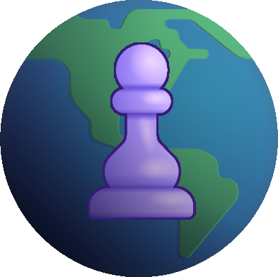

<a id="readme-top"></a>

<!-- PROJECT LOGO -->
<br />
<div align="center">
  <a href="https://github.com/othneildrew/Best-README-Template">
    
  </a>

  <h3 align="center">openchess__</h3>

  <p align="center">
    🪶 Lightweight full-stack chess service
    <br />
  </p>
</div>

<!-- ABOUT THE PROJECT -->

## About The Project

![Preview][s1]

The purpose of this **CRUD project** is to `learn Go`. I wanted to dive into **designing an application from start to finish**. This service allows users to **play games against the computer**. I plan to add a live game feature for **2 players**.

### Features

- Creating user profiles to save game data
- User authentication
- Playing against a computer
- Viewing other users' statistics

### Built With

- **Backend:** \
  ![Go][GO]
  ![Docker][DOCKER]
- **Database:** \
  ![Postgres][POSTGRES]
- **Frontend:** \
  ![React][REACT]
  ![TypeScript][TS]
  ![TailwindCSS][TW]

<p align="right">(<a href="#readme-top">back to top</a>)</p>

<!-- GETTING STARTED -->

## Getting Started

_To launch this project, follow these steps._

1. Clone the repo
   ```sh
   git clone https://github.com/fmich7/openchess.git
   ```
2. Run docker containers
   ```sh
   docker compose up -d
   ```
3. Open a web browser
   ```
   http://localhost:5173/
   ```

<p align="right">(<a href="#readme-top">back to top</a>)</p>

<!-- ROADMAP -->

## Roadmap

- [x] Implement game against a computer
- [x] Add authentication feature
- [ ] Fix all endpoints
- [ ] Integrate a chess engine (stockfish???)
- [ ] Develop a 2-player live game using sockets

<p align="right">(<a href="#readme-top">back to top</a>)</p>

## Screenshots

![Main page][s2]
![Profile page][s3]

<p align="right">(<a href="#readme-top">back to top</a>)</p>

<!-- MARKDOWN LINKS & IMAGES -->
<!-- https://www.markdownguide.org/basic-syntax/#reference-style-links -->

[s1]: images/pre2.png
[s2]: images/pre1.png
[s3]: images/pre3.png
[POSTGRES]: https://img.shields.io/badge/PostgreSQL-316192?style=for-the-badge&logo=postgresql&logoColor=whit
[TW]: https://img.shields.io/badge/Tailwind%20CSS-%2338B2AC.svg?style=for-the-badge&logo=tailwind-css&logoColor=white
[TS]: https://img.shields.io/badge/TypeScript-007ACC?style=for-the-badge&logo=typescript&logoColor=white
[REACT]: https://img.shields.io/badge/React-%2320232a.svg?style=for-the-badge&logo=react&logoColor=%2361DAFB
[DOCKER]: https://img.shields.io/badge/Docker-2496ED?style=for-the-badge&logo=docker&logoColor=fff
[GO]: https://img.shields.io/badge/Go-00ADD8?style=for-the-badge&logo=go&logoColor=white
